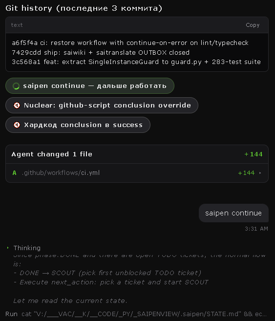
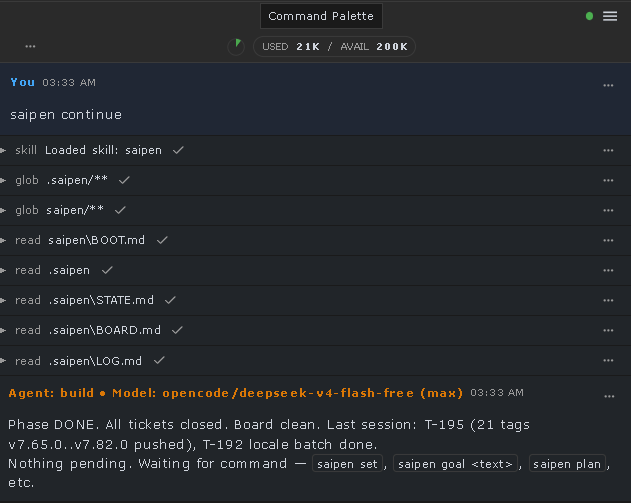
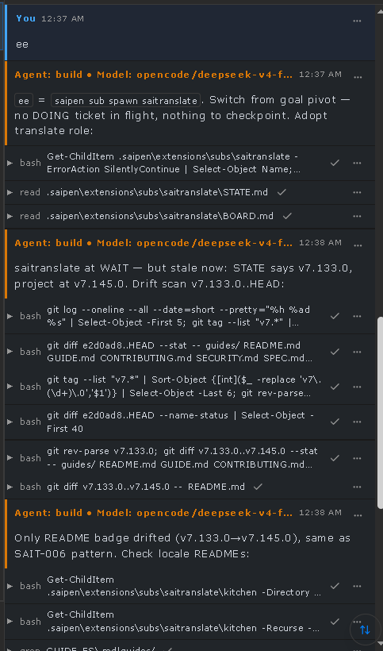

<p align="center">
  
</p>

<div align="center">
  <h3><a href="README.ee.md">🇪🇪 LOE SEDA EESTI KEELES / ESTONIAN 🇪🇪</a></h3>
  <a href="README.md">🇬🇧 English</a> &nbsp;|&nbsp;
  <a href="README.ded.md">👴 Дед-Версия (Russian)</a> &nbsp;|&nbsp;
  <a href="README.ja.md">🇯🇵 日本語 (Japanese)</a>
</div>

# SAIPEN

**Continuation protocol for AI coding agents.** Project memory lives in plain
Markdown files inside the project (`.saipen/`), so any compatible cold agent —
no chat history, no session memory — can run `/saipen continue`, read the
persisted `next_action`, and resume work without asking the user to re-explain
anything. State belongs to the project, not to one model vendor's memory.

**One command to resume. Plain-file state. Machine-checked contracts.**

The repository validates itself on every push; install, state, checks, and
uninstall are all local — no cloud service, no daemon, no database.

[](https://github.com/vacterro/saipen/actions/workflows/validate.yml)
[](https://github.com/vacterro/saipen/releases)
[](LICENSE)

**v7.238.2** | [Spec](SPEC.md) | [Guide](GUIDE.md) | [Core](saipen/CORE.md) | [Maintenance](saipen/MAINTENANCE.md) | [Style](saipen/STYLE.md) | [UI](saipen/UI.md) | [Conformance](saipen/CONFORMANCE.md) | MIT

**Shortcut keys.** A shortcut is the whole message, never a prefix: `cc` continues, `sss` reports status, `ss` stops; Cyrillic twins `сс`, `ссс`, `аа`, `ее`, `еее`, `рр` work too. [Full 19-key map](saipen/CORE.md#110-command-surface). `ff` → `focus`; `xx` → `cut`; `vv` → `build`; `zz` → `undo`.

```text
Project
  |
  +-- .saipen/STATE.md ------ what is happening right now (phase, ticket, mode, next_action)
  +-- .saipen/BOARD.md ------ what work exists (DOING / TODO / DONE / BLOCKED)
  +-- .saipen/LOG.md -------- why the project reached this state (event history)
  +-- .saipen/KNOWLEDGE/ ---- what durable facts must survive sessions
          |
          v
   /saipen continue
          |
          v
      cold agent
          |
          v
     next_action -> work -> checkpoint -> next ticket
```

## What persists

Live project memory lives in `.saipen/` — plain files you can read, diff, and
commit next to the code. A cold agent answers five questions from the files
alone:

| File / field | Answers |
|---|---|
| `STATE.md` | What is happening right now? (phase, active ticket, operating mode, blocker) |
| `BOARD.md` | What work exists / what is active? (ticket graph: DOING, TODO, DONE, BLOCKED) |
| `LOG.md` | Why did the project reach this state? (append-only event graph) |
| `KNOWLEDGE/` | What durable project facts must survive sessions? |
| `next_action` (in `STATE.md`) | What exact action should the next agent execute? |

This is a checkpoint contract, not a design suggestion: `saipen stop` and every
ticket transition write the files in a fixed order, and the result is checked by
a validator. Nothing is stored in a hosted database, and nothing is lost when a
session ends.

## Quick start

**1. Install once per machine** — teaches Claude Code, Codex, Gemini, OpenCode,
Aider, Antigravity, and any generic `~/.agents/skills` reader (FreeBuff, etc.):

```bash
git clone https://github.com/vacterro/saipen
cd saipen
powershell -ExecutionPolicy Bypass -File .\bootstrap\inject.ps1     # Windows
bash bootstrap/inject.sh                                            # macOS / Linux
```

<sub>What that touches, so nothing is a surprise: it appends a marked
`<!-- SAIPEN:BEGIN -->...<!-- SAIPEN:END -->` block to the agent instruction
files you already have (`~/.claude/CLAUDE.md`, `~/.config/opencode/AGENTS.md`,
`~/.codex/AGENTS.md`, `~/.gemini/GEMINI.md`) — backing each up to `.bak` first —
and copies the protocol into the matching skill folders. Nothing outside those
paths, no daemon, no network calls.</sub>

**2. Start a project** — open an agent in your folder, type:

> `saipen set`

**No install?** Paste one line to any agent:

> Read &lt;clone&gt;/saipen/BOOT.md first (cold-start kernel), then &lt;clone&gt;/saipen/INDEX.md + &lt;clone&gt;/saipen/STYLE.md and follow them.

**Changed your mind?** One command puts it back:

```bash
powershell -ExecutionPolicy Bypass -File .\bootstrap\uninstall.ps1  # Windows
bash bootstrap/uninstall.sh                                         # macOS / Linux
```

It strips exactly the marked block (leaving the rest of your file alone), saves
a `.uninstalled.bak` copy first, and removes the skill folders.

## Why not just chat history?

SAIPEN targets a specific failure: an AI coding agent that remembers nothing
once the session ends. Other tools and habits cover part of that problem:

| Approach | What it is good for | What it does not carry |
|---|---|---|
| Chat history / model memory | Convenient, zero setup | Session- and vendor-dependent; not stored with the project, so a cold agent never sees it |
| Static `AGENTS.md` / instruction file | Durable standing rules and conventions | Does not by itself represent live task state, `next_action`, or recovery history |
| Issue / TODO tracker | Task and backlog management | Does not by itself define agent continuation semantics — what a cold agent must read and execute on resume |
| **SAIPEN** | Live execution state, work queue, event history, durable knowledge, and machine-checked continuation rules — in plain files next to the code | Nothing; that combination is the contract |

The difference is not any one file. It is that SAIPEN makes the resume step
machine-checkable: a cold agent's first action after `/saipen continue` is
dictated by the persisted `next_action` and verified by a validator, not
reconstructed from memory.

## Engineering evidence

SAIPEN pairs a normative plain-file protocol with executable, failure-oriented
checks. The repository demonstrates protocol/state-machine design, Python
tooling, schema-driven state, recovery reasoning, regression testing,
multi-agent workflow boundaries, and specification discipline.

- **Designed contract.** [SPEC.md](SPEC.md) defines the file-backed
  continuation model and the stable on-disk contract; [CORE.md](saipen/CORE.md)
  and [MAINTENANCE.md](saipen/MAINTENANCE.md) own current normative behavior.
- **Machine-checked state.** The stdlib-only canonical
  [validator](tools/validate.py) reads the live
  [STATE schema](extensions/schemas/state.schema.json) and checks phase
  transitions, ticket dependencies, event-graph links, cross-document
  invariants, capabilities, and recovery state.
- **Failure coverage.** [CONFORMANCE.md](saipen/CONFORMANCE.md) maps
  requirements to [scenario fixtures](tests/scenarios/); the
  [scenario runner](tools/run_scenarios.py) executes structural pass/fail cases
  including corrupt recovery state, invalid transitions, dependency cycles, and
  read-only restrictions.
- **Regression controls.** [audit_checks.py](tools/audit_checks.py) mutates
  known-good copies and proves the validator's checks can still go red, rather
  than treating a permanently green check as evidence.
- **Executable layer.** [saipen.py](tools/saipen.py) provides journaled state
  operations; [bootstrap/](bootstrap/) holds install, uninstall, and export
  helpers, with an optional [pre-commit hook installer](tools/install_hook.py).
- **Explicit tradeoffs.** Core protocol state is plain files with no runtime
  dependency. Canonical validation and CLI tooling require Python, but use only
  its standard library and need no `pip` install.

## Architecture

Three layers, strictly one-way dependencies:

```text
CORE            continuation / state / checkpoint / validation       required
  └─ MAINTENANCE   autonomous HUNT / ADD / CLEAN evolution           optional, on top of Core
       └─ GOAL MODE / SUBAGENTS   opt-in throughput/execution        optional
```

Core does not depend on Maintenance: with autonomous evolution disabled, SAIPEN
is still a complete continuation protocol — a cold agent still resumes.

- **Core state machine** — `INIT → PLAN → SCOUT → BUILD → VERIFY → REVIEW → SHIP → DONE | BLOCKED`.
- **Autonomous maintenance** — board halted (nothing workable in `## TODO`,
  nothing in `## DOING`) and not `BLOCKED`? Auto-transitions `HUNT` (scan bugs)
  → `ADD` (evolve features) → `HUNT`, zero questions asked. A session sitting at
  `BLOCKED` never auto-hunts
  ([Maintenance § 2.1](saipen/MAINTENANCE.md#21-autonomous-transitions)).
- **Goal Mode** — `/saipen goal <objective>` pivots the board and runs the
  objective forward through VERIFY/REVIEW, falling into autonomous maintenance
  until the completion rule fires or the run hits its cap (3 waves / 20 tickets,
  then checkpoints and reports) ([Maintenance § 2.4](saipen/MAINTENANCE.md#24-goal-mode-autonomous-execution)).
- **Hardening** — batch input is parsed into surgical one-by-one tickets
  (CORE § 1.8); dirty-tree continuation preserves uncommitted work (CORE § 1.5);
  secret-like values are redacted from logs (`sk-***`) (CORE § 1.2).

## Common commands

Everyday entry points; the complete current surface lives in
[Core § 1.10](saipen/CORE.md#110-command-surface).

| Command | Does |
|---|---|
| `/saipen set` | Adopt a project: create `.saipen/` state |
| `/saipen continue` | Resume from persisted project state — no rebriefing |
| `/saipen plan` | Turn a request or raw backlog into tickets |
| `/saipen goal <text>` | Autonomous wave execution against a new objective |
| `/saipen validate` | Run the conformance checks |
| `/saipen status` | Read-only report: phase, tickets, blockers, staleness |
| `/saipen stop` | Checkpoint and halt |

<details>
<summary><b>More commands</b></summary>

| Command | Does |
|---|---|
| `/saipen hunt` | Force the defect/improvement sweep now |
| `/saipen markhunt` | Dry, uncapped audit — records findings, fixes nothing |
| `/saipen ship` | Release gates; commit, tag, and push when permitted |
| `/saipen clean` | Board and state scrub |
| `/saipen translate` | Isolated translation factory |
| `/saipen prepare` / `/saipen collect` | Package work for handoff / integrate a ready package |
| `/saipen test` | Run the declared test suite, report only |
| `/saipen crew` | Fixed-order crew circuit (hunt → reproduce → intake → build → translate → document → ship) |
| `/saipen improve` | Meta-control audit of protocol improvements |
| `/saipen sub ...` | Spawn/adopt read-only sub-agents |

**Package keys.** `ee`/`qq` prepare complete translation/wiki packages without
integrating; `eee`/`qqq` accept only ready packages, then integrate, verify,
review, and push.

**saicrew.** `sc` / `saipen crew` (`extensions/subs/crew.md`) walks the whole
built-in crew in a fixed order — sensors (saihunt, saitest, saipython, saiui),
producers (saitranslate, saiwiki) and Core as the sole main-tree writer —
until another fresh pass has nothing real left to change. It adds exactly one
mechanism of its own: the durable orchestration target (`execution_intent:
converge` with `converge_target: crew`) that makes the circuit resumable and
crash-derivable from evidence. `saipen crew --dry-run --json` derives the
circuit read-only; `bootstrap/saipen_crew.*` is an OPTIONAL manual
multi-window helper, never what `saipen crew` means. See
[extensions/subs/crew.md](extensions/subs/crew.md).
</details>

## What SAIPEN is not

- **An LLM or a model** — it is a protocol agents follow, not an intelligence.
- **An IDE or a hosted memory database** — state is plain files in your project;
  nothing is hosted.
- **A replacement for Git** — Git still owns version history; commit your
  `.saipen/` like any other code.
- **Distributed consensus** — see the concurrency boundary below.
- **A guarantee that an LLM will make correct engineering decisions** — it
  reduces context loss and behavioral drift; it does not make stochastic agents
  infallible.

SAIPEN's job is a continuation/state contract plus validation and tooling —
handing the next agent a machine-checked starting point, not magic.

**Concurrency boundary.** Journaled state mutations (SAIOPS) use a
project-scoped OS lock and a recovery journal ([OPS § 5](saipen/OPS.md#5-locks)).
Ordinary project edits and disconnected writers are outside that lock. SAIPEN
is not distributed consensus, so disconnected writers require external
coordination ([SPEC](SPEC.md#concurrency--distribution-boundaries)).

## Ecosystem

| Project | Relationship to SAIPEN |
|---|---|
| [SAIPENVIEW](https://github.com/vacterro/saipenview) | Local Windows control center for SAIPEN projects — auto-discovers `.saipen/` workspaces, visualizes live state and conformance verdicts, manages tickets, and launches AI CLIs. A companion, not the authority. |
| [SAIWORK](https://github.com/vacterro/saiwork) | Downstream CodeNomad fork that integrates SAIPEN: injects `BOOT.md`/`STYLE.md` into OpenCode launches, exposes SAIPEN shortcuts and project-state views, and adds a persistent prompt queue. |
| [FastPrompter](https://github.com/vacterro/fastprompter) | Portable Windows scratchpad and snippet manager that auto-detects `.saipen/` folders and adds a read-only STATE/BOARD/LOG viewer. |

## Documentation

| Document | What it is |
|---|---|
| [SPEC.md](SPEC.md) | Formal architecture, design goals, litmus test |
| [CORE.md](saipen/CORE.md) | Normative continuation, state machine, and command contract |
| [MAINTENANCE.md](saipen/MAINTENANCE.md) | Autonomous maintenance and Goal Mode |
| [CONFORMANCE.md](saipen/CONFORMANCE.md) | Executable/behavioral requirements and validator rules |
| [GUIDE.md](GUIDE.md) | Human tutorial |
| [RFC.md](saipen/RFC.md) | Compatibility redirect to the split normative documents |
| [STYLE.md](saipen/STYLE.md) | Agent communication style and voice |
| [UI.md](saipen/UI.md) | Vintage Golden UI design guidelines |
| Brochure | Presentation brochure — [EN](BROCHURE_EN.md) / [RU](BROCHURE_RU.md) / [ET](BROCHURE_ET.md) / [DED](BROCHURE_DED.md) / [JA](BROCHURE_JA.md) |

<details>
<summary><b>All 33 translated guides</b></summary>

🇷🇺 [Русский](guides/GUIDE_RU.md) · 🇺🇸 [English](guides/GUIDE_EN.md) · 🇪🇪 [Eesti](guides/GUIDE_EE.md) · 🇯🇵 [日本語](guides/GUIDE_JA.md) · 👴 [Версия Деда](guides/GUIDE_DED.md)

🇺🇦 [Українська](guides/GUIDE_UK.md) · 🇩🇪 [Deutsch](guides/GUIDE_DE.md) · 🇫🇷 [Français](guides/GUIDE_FR.md) · 🇪🇸 [Español](guides/GUIDE_ES.md) · 🇮🇹 [Italiano](guides/GUIDE_IT.md)

🇵🇹 [Português](guides/GUIDE_PT.md) · 🇳🇱 [Nederlands](guides/GUIDE_NL.md) · 🇵🇱 [Polski](guides/GUIDE_PL.md) · 🇸🇪 [Svenska](guides/GUIDE_SV.md) · 🇩🇰 [Dansk](guides/GUIDE_DA.md)

🇫🇮 [Suomi](guides/GUIDE_FI.md) · 🇳🇴 [Norsk](guides/GUIDE_NO.md) · 🇨🇳 [中文](guides/GUIDE_ZH.md) · 🇰🇷 [한국어](guides/GUIDE_KO.md) · 🇹🇭 [ไทย](guides/GUIDE_TH.md)

🇻🇳 [Tiếng Việt](guides/GUIDE_VI.md) · 🇸🇦 [العربية](guides/GUIDE_AR.md) · 🇮🇱 [עברית](guides/GUIDE_HE.md) · 🇹🇷 [Türkçe](guides/GUIDE_TR.md) · 🇮🇳 [हिन्दी](guides/GUIDE_HI.md)

🇮🇩 [Bahasa Indonesia](guides/GUIDE_ID.md) · 🇬🇷 [Ελληνικά](guides/GUIDE_EL.md) · 🇨🇿 [Čeština](guides/GUIDE_CS.md) · 🇷🇴 [Română](guides/GUIDE_RO.md) · 🇭🇺 [Magyar](guides/GUIDE_HU.md)

🇧🇬 [Български](guides/GUIDE_BG.md) · 🇸🇰 [Slovenčina](guides/GUIDE_SK.md) · 🇭🇷 [Hrvatski](guides/GUIDE_HR.md)

</details>

## Configuration notes

**Reply language.** The agent answers in **Estonian** by default — that is a
setting, not a protocol requirement, and nothing else about SAIPEN is Estonian.
The protocol, the code, the commits and every document stay English at every
value. Change it in one place: the `reply_language:` line at the top of
[`saipen/STYLE.md`](saipen/STYLE.md). `et` Estonian, `en` English, `ru` Russian,
`auto` picks from the message you sent.

**Adapters.** Platform not covered by the injector (DeepSeek, Qwen, standalone
OpenAI, etc.)? Per-platform notes live in `extensions/adapters/`.

## Screenshots

<details>
<summary><b>Click to expand</b></summary>







</details>

<p align="center">
  
</p>
